# PGA Score 
Live: https://markclinton.github.io/pga-score/

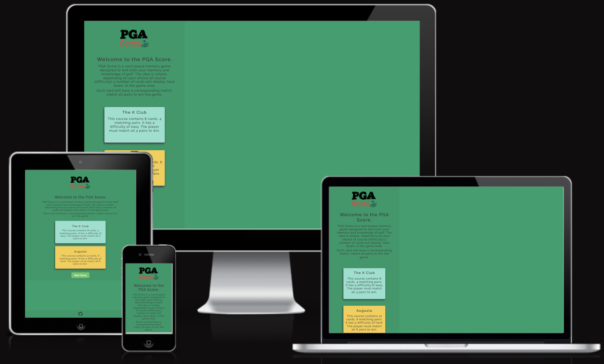

## About
PGA Score is a golf themed Javascript web game. The game itself is based upon the classic card memory game. A user must 
click a card, which is face down, and click another card to find the corresponding match. If they don't find a match, both
cards flip back over. If they do find a match, the cards remain flipped. The game is only over when all cards are flipped. 
The underlying game itself is simple, the theme of golf is to give the game a fun aspect. 

## Design
The game is intended to be fun and engaging. Green colours used are to represent a golf course. The accent colours mimic 
the colours used by the PGA website. PDF can be seen here for more details on the design documentation.

- ### Colour Scheme 
The main colours of the site (#009f6b, #009966) are different shades of green. Used to represent the different shades found
on a golf course. the accent colours (#163B7C) mimic the colour used by PGA. It elicits a familiar, nostalgic feeling 
 used by the already existing brand PGA.  

 [Link to Design Ideas PDF](documentation/design/PGA%20Score%20-%20Design%20Ideas.pdf)

- ### Imagery
The main logo is a play on the PGA Tour logo. It was traced from the original PGA Tour logo and tour was replaced with the word
score. This was done using the Freeform app for MacOS. The imagery used on the back of the playing cards is the same image of a 
golfer used by the PGA. The front face of the cards is images of golfers who play on the PGA Tour. 

[Link to Card Design PDF](documentation/design/PGA%20Score%20-%20Card.pdf)

[Link to Logo Design PDF](documentation/design/PGA%20Score%20-%20Logo.pdf)

- ### Typography 
Google Font was used to choose the font for this website. The font used for the site is [Raleway](https://fonts.google.com/specimen/Raleway) for
no other reason than I thought it looked nice. It serves as both the H and p elements.

- ### Wireframes
Prototypes for the website were designed using Freeform. 

[Link to the Webpages PDF](documentation/design/PGA%20Score%20-%20Web%20Page%20Mockup.pdf)

- ### Workflow
The initial workflow for the website was also created using Freeform.

[Link to the Workflow PDF](documentation/design/PGA%20Score%20-%20Workflow.pdf)

## Target Audience
The target audience would be anyone who likes to play web based games and has an interest in golf. The idea behind this game
is that it wouldnt look out on an old flash based game websites.

## Features

- ### Two Game Modes
  - User has a choice of two game modes. Easy or Hard. Easy consists of 8 cards displayed in the game area. Hard consists
  of 12 cards displayed in the game area.

    

Game Modes
 

    
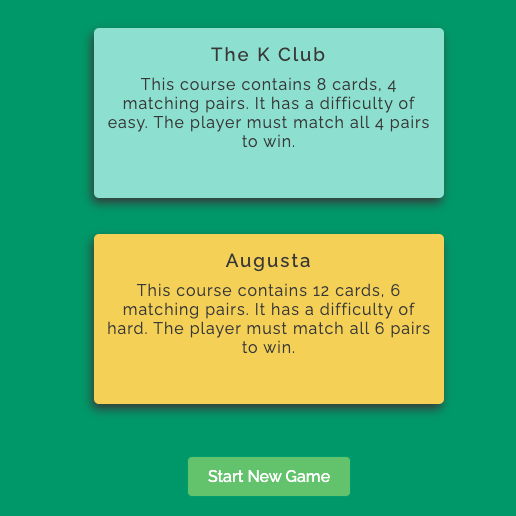

    

- ### User Name 
  - A user can enter their name which will be displayed above the game area.

    

User Name
 

    
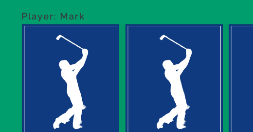

    

- ### Card Shuffle 
  - Cards are placed in the game area at random. The game area utilises flex box and the cards are given an order. The 
  order is calculated using a random number between 1 and the number of cards on display. The user will get unique 
  placement of cards every time they play. 

    

Card Shuffle
 

    
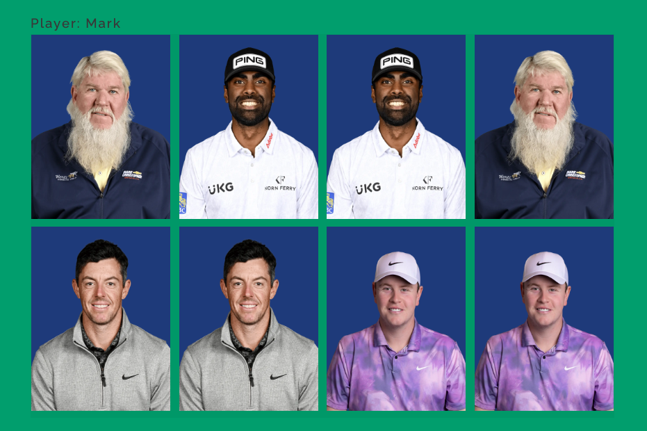

    
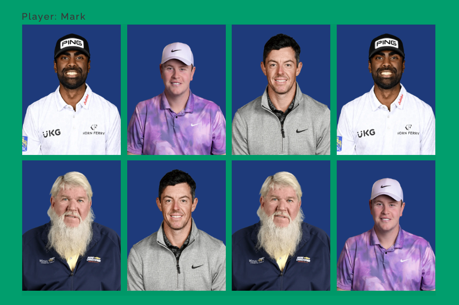

    

- ### Restart Game Option
  - The user has the option to restart a game when they match all cards. It directly brings them to the new game popup modal. 

    

Restart Game Option
 

    
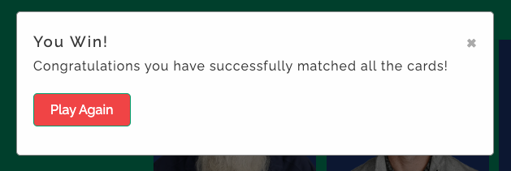

    

- ### Game Flow 

  - #### Two Card Selection
    - Only 2 cards can be selected and flipped at any given time in the game area. 

    

Two Card Selection
 

    
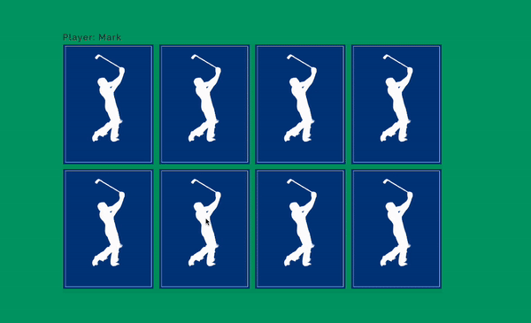

    

  - #### Matched Card Control 
    - When 2 cards are matched, clicking them will not flip them. They become inactive.  

    

Matched Card Control
 

    
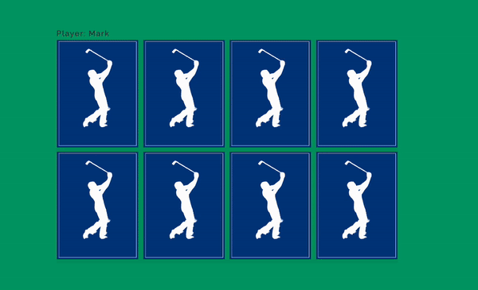

    

  - #### Non Matched Card Control
    - When 2 cards are clicked but do not match, they will flip back over.  

    

Non Matched Card Control
 

    

    

- ### End Game Notification
  - The user will get a pop up modal when they complete the game saying congratulations. 

    

End Game Notification
 

    

    

- ### Save Users Name on Restart
  - The user's name will be saved into the text input if they choose to restart a game.

    

Save Users Name on Restart
 

    
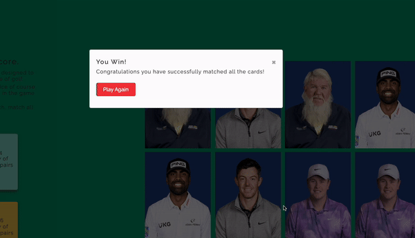

    

- ### Immersive Theme
  - The theme takes elements from already existing media such as PGA Tour and builds upon it to give a sense of familiarity.

    

Immersive Theme
 

    
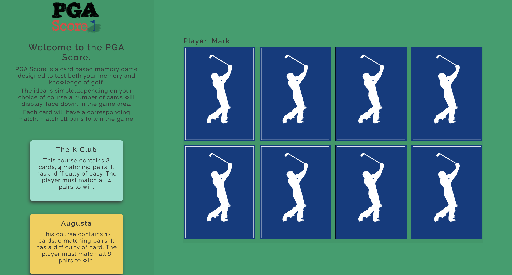

    

- ### Responsive Design
  - The game is playable on mobile but we recommend using a bigger screen for the best experience. 

    

Responsive Design
 

    
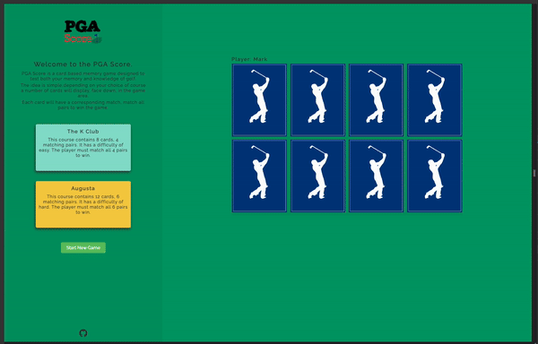

    

### Future Features
1. A timer. A timer starts when the game area is populated with cards and records the time taken for a user to match all cards. 
I initially wrote this into the spec before starting the project but never got the time to try and implement it. The idea would
be that, depending on the time, a user would be given a score based on a handicap, just like in golf. It would have been done
in groups i.e. if the user gets a time of 15-20 seconds they would get a handicap of -1. 20-25s would get a handicap of par.
2. Another Game Mode. Currently there is Easy or Hard and determines the amount of cards to be shown in the game area. Hard 
would be renamed to Medium and a new game mode introduced as Hard. The new Hard game mode would consist of half the cards 
being images of golfers and the other half being text. The text would be the last time they won a PGA Championship. The 
player would have to match the image to the last time that golfer won a PGA Championship.
3. Implement more cards. Implement functionality to have a big list of cards created that the game would choose from depending
on the game mode chosen. This would mean that we could have a mix of different cards that could be displayed so a user doesn't
see the same cards every time they play. 
4. Dynamic Modal. Currently the game is using two separate modals defined on index.html. One that popups when the user starts
a game. One that pop ups when a user finishes a game. Having a dynamic modal could mean only defining one modal on index.html
and populating it with elements using javascript, depending on the need for the content. Javascript could handle the content
of a modal making it reusable. 

## Technologies

### Languages
- HTML - Provide the structure of the webpage. 
- CSS - Used in conjunction with HTML for styling elements. 
- JavaScript - Provides the logic of the application. Allowing the end user to interact with the webpage. 

### Other Tools
- [GitHub](https://github.com/) to host the repository
- [GitHub Pages](https://pages.github.com/) to host the deployed site
- [Chrome Dev Tools](https://developer.chrome.com/docs/devtools) for debugging and testing
- [Lighthouse](https://chromewebstore.google.com/detail/lighthouse/blipmdconlkpinefehnmjammfjpmpbjk?hl=en) for performance testing
- [Git](https://git-scm.com/) for version control
- [Google Fonts](https://fonts.google.com/) for fonts
- [GoFullPage](https://gofullpage.com/) to take full page screenshots.
- [Responsive Viewer](https://chrome.google.com/webstore/detail/responsive-viewer/inmopeiepgfljkpkidclfgbgbmfcennb/related?hl=en) for testing my site on all screen sizes.

## Deployment

- ### Github Pages
  - In the repository, navigate to Settings > Pages.
  - From the Source dropdown choose "Deploy from a branch".
  - Choose "main" as the branch.
  - When the master branch is selected it will initiate a build and deployment of the site.
  - Any changes pushed to the main branch will automatically be built and deployed once set up.
  - Link to live GitHub Page can be found [here](https://markclinton.github.io/pga-score/)

- ### Clone Repo
  - Navigate to the [PGA Score](https://github.com/MarkClinton/pga-score) repository.
  - Click "Code" and choose the HTTPS tab.
  - Copy the URL. 
  - Open a terminal window and paste `git clone https://github.com/MarkClinton/pga-score.git` to the directory you want.

## Testing

- ### Screen Size Testing
  - To test the responsiveness of my website across all screen sizes I mainly used the Developer Tools to test this. I also used Responsive Viewer to get an overview of my site on several screens at once to help spot any mistakes. 

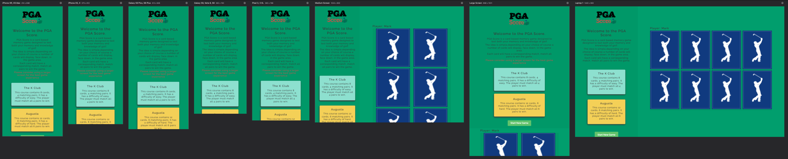

- ### Validator Testing

  - Performance using [Lighthouse](https://chromewebstore.google.com/detail/lighthouse/blipmdconlkpinefehnmjammfjpmpbjk?hl=en) chrome extension
    - [Desktop](documentation/testing_images/lighthouse_desktop.png): Overall score: 100
    - [Mobile](documentation/testing_images/lighthouse_mobile.png): Overall Score: 89

  - JavaScript using [JSHint](https://jshint.com/)
    - [script.js](documentation/testing_images/jshint.png)

  - HTML: using [W3 Validator](https://validator.w3.org/)
    - [index.html](documentation/testing_images/w3_validator.png)

  - CSS: Using [Jigsaw Validator](https://jigsaw.w3.org/css-validator/)
    - [style.css](documentation/testing_images/w3c_validator.png)

- ### Manual Testing 
|  Feature |  Action | Effect | Pass/Fail |
|---|---|---|---|
|Logo|Click Logo|Brings back to Home page| Pass |
|GitHub Logo|Click Logo|Go to repo| Pass |
|Click Start New Game Button|Click|Modal Pops up to start game| Pass |
|Form|Enter Name Input|Doesn't accept only spaces or blank input. min 3 characters, max 15 characters| Pass |
||Enter Course Input|Option must be selected| Pass |
||Click Start Game Button|Starts the game and shows the populated game area| Pass |
|Cards|Click First Card|Flips to show reverse| Pass |
||Click Second Card|Flips to show reverse, if match stay flipped| Pass |
||Click Third Card|Not allowed if 2 are already flipped| Pass |
||Click Matched Card|Should not flip again| Pass |
||Click already flipped Card|Should not flip again| Pass |
||All cards match|End game modal shows| Pass |
|Modal|Click Close Button|Modal closes| Pass |
||Click anywhere outside modal for new game|Modal closes| Pass |
||Click Restart Game button|End game modal closes, new game modal appears| Pass |
||Click Restart Game button|Users name should persist on restart| Pass |
||Click Start New Game button|Users name should reset on new game| Pass |

- ### Sandbox Testing
  - Initial prototyping for this project started out in the [PGA Score Testing](https://github.com/MarkClinton/pga-score-testing) repository. I used this "sandbox" repo to test ideas and functionality. Once happy with a basic level of functionality I took what I learnt and applied it to a new repository which is now the PP2 project [PGA Score](https://github.com/MarkClinton/pga-score?tab=readme-ov-file). The goal of that repository was work quickly to see what functionality I can come up with. The testing repository does not follow best practices. In hindsight, I should have followed a regular commit cadence with this testing repository so as I could go back to when needed and test different versions. 

- ### Compatibility Testing
  - Chrome Desktop Version 126.0.6478.127 
  - Safari Desktop Version 17.5 (19618.2.12.11.6)
  - iPhone XR iOS 17.5.1 Safari App

## Bugs
- Bug: The footer, when resizing the screen was overlapping onto the main element. 
  - _Solution: Add a display: flex to the body and align the header, main & footer elements using flex-direction: column._
  - 

- Bug: The card flip functionality made a weird transition when turning. 
  - _Solution: Add the perspective property to the game-area with a value of 1000px_ 

- Bug: When the initial first card was flipped it could still be selected which invoked the flipCard() function. 
  - _Solution: Add a JS variable called firstCard which is initially set to null. Once the first card is selected and flipped, using 'this' the first card is saved to that variable. FlipCard() then checks if the firstCard variable is clicked, if so it returns out of the function. The same functionality was added for a secondCard variable._
  - 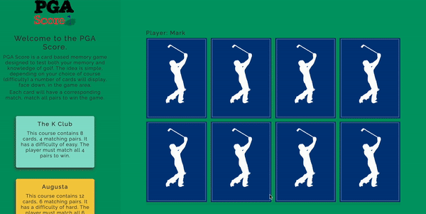

- Bug: A user is able to click as many cards as they wanted, it wasn't limited to 2 cards. This messed with the flow of the game.
  - _Solution: In the flipCard() function, a lockFlip variable was added which didn't allow any other cards to be pressed until checkCardsMatch()finished._
  - 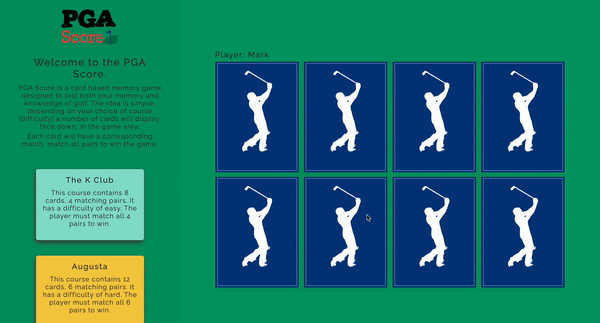

- Bug: Cards could still be clicked when they were flipped and a matching pair. The EventListener was still attached. 
  - _Solution: When a pair is found we call a function to remove the EventListener from those cards._

- Bug: When dynamically adding cards to the game area in a loop it would only ever add the last element to the game area. 
  - _Solution: Use cloneNode() when appending. Not using this meant I was adding the same element multiple times just moving down in the DOM._

- Bug: A card was still flipping when the eventListener was removed. It wasn't fully flipping over as shown in the gif below. 
  - _Solution: CSS class was only declared as '.flip' instead of '.card.flip.' Which meant that the 'card:active' class was enabled to carry out the transform property when the card was active._
  - 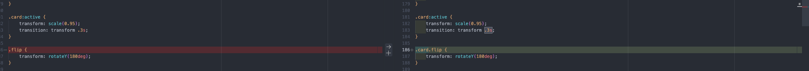
  - 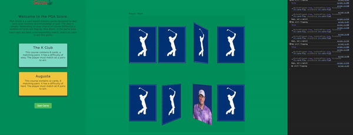

- Bug: Global variables used in the flipCard() function are needed in the global scope to keep track of the logic. 
  - _Solution: In order to minimise the variables in the Global Scope a namespace object was used to declare a number of variables in the global scope_

## Credits

- ### Resources
  - [Favicon Generator. For real.](https://realfavicongenerator.net/) to generate free favicons.
  - [Google Fonts](https://fonts.google.com/) for a range of free fonts. 
  - [Stack Overflow](https://stackoverflow.com/) for help answering questions
  - [W3 Schools](https://www.w3schools.com/) for documentation and interactive help with html and css.
  - [Freeform](https://en.wikipedia.org/wiki/Freeform_(Apple)) for design and creating documents.
  - [EZGif](https://ezgif.com/maker) for creating gifs for the ReadMe
  - [Cloud Convert](https://cloudconvert.com/) for converting images to .webp format.
  - [Love Maths](https://github.com/MarkClinton/love-maths) the Love Maths project was a great resource which I used for JS logic.
  - [Sporting M.C.](https://github.com/MarkClinton/sporting-mc) My PP1 Sporting M.C. was a good resource for HTML and CSS that was used. 
  - [Memory Game - Vanilla JavaScript](https://marina-ferreira.github.io/tutorials/js/memory-game/) Used as an initial resource to conceptualise the logic needed.
  - [Modern Javascript Tutorial](https://javascript.info/) Modern Javascript Tutorial helped explain aspects of Javascript
  - [MDN Web Docs](https://developer.mozilla.org/en-US/docs/Web/JavaScript) MDN Web Docs had some great explanations of built in JS functions

- ### Media
  - [PGA Tour](https://www.pgatour.com/) for all images of golfers, inspiration for the logo and back of the card.

- ### Helpful Links

  - [How to flip a card](https://www.w3schools.com/howto/howto_css_flip_card.asp) - To help get the initial functionality off the ground
  - [Display an image from an array in JS](https://www.geeksforgeeks.org/how-to-display-images-from-an-array-in-javascript/) - To help with dynamically adding images to the DOM
  - [Adding elements in a loop to dom](https://stackoverflow.com/questions/69445670/javascript-for-loop-appends-same-element-once) - Also to help with dynamically adding images to the DOM
  - [Set the source of an image in JS](https://stackoverflow.com/questions/1232793/javascript-set-img-src) - How to set the source of an image in JavaScript
  - [Desktop-First Media Queries](https://joegalley.com/articles/mobile-first-vs-desktop-first-media-queries#:~:text=If%20you%20expect%20your%20desktop,template%20on%20progressively%20smaller%20screens) - To know the media query screen sizes needed for desktop first approach
  - [Trim() function JS](https://stackoverflow.com/questions/8120983/trim-spaces-from-form-input) - To help remove whitespace in user input
  - [Calc in CSS](https://www.w3schools.com/cssref/func_calc.php) - To help calculate the width of the cards in the game area
  - [How To - CSS/JS Modal](https://www.w3schools.com/howto/howto_css_modals.asp) - How to create and use a modal with JS, HTML and CSS
  - [Shift() function JS](https://developer.mozilla.org/en-US/docs/Web/JavaScript/Reference/Global_Objects/Array/shift) - How to remove the first element of an array and save it to a variable
  - [Check if all elements have the same class](https://www.geeksforgeeks.org/how-to-find-whether-all-element-contains-same-class-or-not/) - Helped to find out when all cards matched to display game end modal.
  - [Access form data through event property](https://stackoverflow.com/questions/72982035/can-you-access-a-html-form-data-from-the-event-property-or-a-this-keyword-in) - To help gather form data before 'submitting' the user to the game
  - [Using a namespace in JS](https://stackoverflow.com/questions/6928926/what-advantages-are-gained-by-using-namespaces-in-javascript) - To help minimise variables in the global scope. 

- ### Acknowledgments 
  - I would like to thank my mentor Juliia for her help and encouragement along the way with this project.
  - My girlfriend Aoife for her patience and for making countless cups of tea to help me through this

