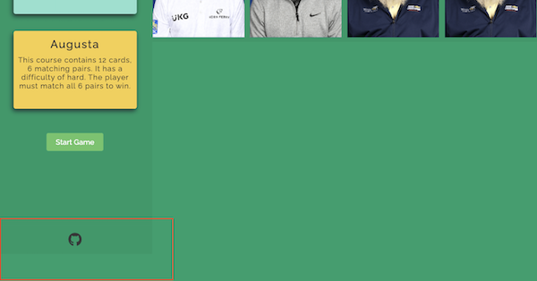

# PGA Score 
Live: https://markclinton.github.io/pga-score/

## About
PGA Score is a golf themed Javascript web game. The game itself is based upon the classic card memory game. A user must 
click a card, whoch is face down, and click another card to find the corresponding match. If they dont find a match, both
cards flip back over. If they do find a match, the cards remain flipped. The game is only over when all cards are flipped. 
The underlying game itself is simple, the theme of golf is to give the game a fun aspect. 

## Design
The game is intended to be fun and engaging. Green colours used are to represent a golf course. The accent colours mimic 
the colours used by the PGA website. PDF can be seen here for more details on the design documentation.

- ### Colour Scheme 
The main colours of the site (#009f6b, #009966) are different shades of green. Used to represent the different shades found
on a golf course. the accent colours (#163B7C) mimic the colour used by PGA. It elicits a familiar, nostalgic feeling 
 used by the already exisitng brand PGA.  

 [Link to Design Ideas PDF](documentation/design/PGA%20Score%20-%20Design%20Ideas.pdf)

- ### Imagery
The main logo is a play on the PGA Tour logo. It was traced from the original PGA Tour logo and tour was replaced with the word
score. This was done using the Freeform app for MacOS. The imagery used on the back of the playing cards is the same image of a 
golfer used by the PGA. The front face of the cards is images of golfers who play on the PGA Tour. 

[Link to Card Design PDF](documentation/design/PGA%20Score%20-%20Card.pdf)

[Link to Logo Design PDF](documentation/design/PGA%20Score%20-%20Logo.pdf)

- ### Typography 
Google Font was used to choose the font for this website. The font used for the site is [Raleway](https://fonts.google.com/specimen/Raleway) for
no other reason than I thought it looked nice. It serves as both the H and p elements.

- ### Wireframes
Prototypes for the website were designed using Freeform. 

[Link to the Webpages PDF](documentation/design/PGA%20Score%20-%20Web%20Page%20Mockup.pdf)

- ### Workflow
The initial workflow for the website was also created using Freeform.

[Link to the Webpages PDF](documentation/design/PGA%20Score%20-%20Workflow.pdf)

## Target Audience
The target audience would be anyone who like to play web based games and has an interest in golf. The idea behind this game
would that it wouldnt look out of place in a list on one of those old flash based game websites.

## Features

- ### Two Game Modes
  - User has a choice of two game modes. Easy or Hard. Easy consists of 8 cards displayed on the game area. Hard consists
  of 12 cards displayed on the game area.

    

Game Modes
 

    

    

- ### User Name 
  - User can enter their name which will be displayed above the game area.

    

User Name
 

    

    

- ### Card Shuffle 
  - Cards are placed on the game area at random. The game area utilises flex box and the cards are given an order. The 
  order us calculated using a random number between 1 and the number of cards on display. The user will get unique 
  placement of cards everytime they play. 

    

Card Shuffle
 

    

    

    

- ### Restart Game Option
  - The user has the option to restart a game when they match all cards. It directly brings them to the new game popup modal. 

    

Restart Game Option
 

    

    

- ### Game Flow 

  - #### Two Card Selection
    - Only 2 cards can be selected and flipped at any given time on the game area. 

    

Two Card Selection
 

    

    

  - #### Matched Card Control 
    - When 2 cards are matched, clicking them will not flip them. They become inactive.  

    

Matched Card Control
 

    

    

  - #### Non Matched Card Control
    - When 2 cards are clicked but do not match, they will flip back over.  

    

Non Matched Card Control
 

    

    

- ### End Game Notification
  - The user will get a pop up modal when they complete the game saying congratulations. 

    

End Game Notification
 

    

    

- ### Save Users Name on Restart
  - The users name will be saved into the text input if they choose to restart a game.

    

Save Users Name on Restart
 

    

    

- ### Information Section When Game Is Won

- ### Immersive Theme
  - The theme takes elements from already existing media such as PGA Tour and builds upon it to give a sense of familiarity.

    

Immersive Theme
 

    

    

- ### Responsive Design
  - The game is playable on mobile but we reccomend using a bigger screen for the best experience. 

    

Responsive Design
 

    

    

### Future Features
1. A timer. A timer starts when the game are is populated with cards and records the time taken for a user to match all cards. 
I intially wrote this into the spec before starting the project but never got the time to try and implement it. The idea would
be that, depending on the time, a user would be a given a score based on a handicap, just like in golf. It would have been done
in groups i.e. if the user gets a time of 15-20 seconds they would get a handicap of -1. 20-25s would get a handicap of par.
2. Another Game Mode. Currently there is Easy or Hard and determines the amount of cards to be shown on the game area. Hard 
would be renamed to Medium and a new game mode introduced as Hard. The new Hard game mode would consist of half the cards 
being images of golfers and the other half being text. The text would be the last time they won a PGA Championship. The 
player would have to match the image to the last time that golfer won a PGA Championship.
3. Implement more cards. Implement functionality to have a big list of cards created that the game would choose from depending
on the game mode chosen. This would mean that we could have a mix of different cards that could be displayed so a user doesnt
see the same cards every time they play. 
4. Dynamic Modal. Currently the game is using two separate modals defined on index.html. One that popups when the user starts
a game. One that pop ups when a user finishes a game. Having a dynamoc modal could mean only defining one modal on index.html
and populating it with elements using javascript, depending on the need for the content. Javascript could handle the content
of a modal making it re-usable. 

## Technologies

### Languages
- HTML - Provide the structure of the webpage. 
- CSS - Used in conjunction with HTML for styling elements. 
- JavaScript - Provides the logic of the application. Allowing the end user the interact with the webpage. 

### Other Tools
- [GitHub](https://github.com/)
- [GitHub Pages](https://pages.github.com/)
- [Chrome Dev Tools](https://developer.chrome.com/docs/devtools)
- [Lighthouse](https://chromewebstore.google.com/detail/lighthouse/blipmdconlkpinefehnmjammfjpmpbjk?hl=en)
- [Git](https://git-scm.com/)
- [Google Fonts](https://fonts.google.com/)
- [GoFullPage](https://gofullpage.com/) to take full page screenshots.
- [Responsive Viewer](https://chrome.google.com/webstore/detail/responsive-viewer/inmopeiepgfljkpkidclfgbgbmfcennb/related?hl=en) for testing my site on all screen sizes.

## Deployment

- ### Github Pages
  - In the repository, navigate to Settings > Pages.
  - From the Source dropdown choose "Deploy from a branch".
  - Choose "main" as the branch.
  - When the master branch is selected it will initiate a build and deployment of the site.
  - Any changes pushed to the main branch will automatically be built and deployed once set up.
  - Link to live GitHub Page can be found [here](https://markclinton.github.io/pga-score/)

- ### Clone Repo
  - Navigate to the [PGA Score](https://github.com/MarkClinton/pga-score) repository.
  - Click "Code" and choose the HTTPS tab.
  - Copy the URL. 
  - Open a terminal window and paste `git clone https://github.com/MarkClinton/pga-score.git` to the directory you want.

## Testing

- ### Screen Size Testing

- ### Validator Testing

  - Performance using [Lighthouse](https://chromewebstore.google.com/detail/lighthouse/blipmdconlkpinefehnmjammfjpmpbjk?hl=en) chrome extension
    - [Desktop](documentation/testing_images/lighthouse_desktop.png): Overall score: 100
    - [Mobile](documentation/testing_images/lighthouse_mobile.png): Overall Score: 89

  - JavaScript using [JSHint](https://jshint.com/)
    - [script.js](documentation/testing_images/jshint.png)

  - HTML: using [W3 Validator](https://validator.w3.org/)
    - [index.html](documentation/testing_images/w3_validator.png)

  - CSS: Using [Jigsaw Validator](https://jigsaw.w3.org/css-validator/)
    - [style.css](documentation/testing_images/w3c_validator.png)

- ### Manual Testing 

- ### Compatibility Testing

## Bugs
- Bug: The footer, when resizing the screen was overlapping onto the main element. 
  - _Solution: Add a display: flex to the body and align the header, main & footer elements using flex-direction: column._
  - 

- Bug: The card flip functionlaity made a weird transition when turning. 
  - _Solution: Add the perspective property to the game-area with a value of 1000px_ 

- Bug: When the initial first card was flipped it could still be selected which invoked the flipCard() function. 
  - _Solution: Add a JS variable called firstCard which is initially set to null. Once the first card is selected and flipped, using 'this' the first card is saved to that variable. FlipCard() then checks if the firstCard variable is clicked, if so it returns out of the function. The same functionality was added for a secondCard variable._
  - 

- Bug: A user is able to click as many cards as they wanted, it wasnt limited to 2 cards. This messed with the flow of the game.
  - _Solution: In the flipCard() function, a lockFlip variable was added which didnt allow any other cards to be pressed until checkCardsMatch()finished._
  - 

- Bug: Cards could still be clicked when they were flipped and a matching pair. The EventListener was still attached. 
  - _Solution: When a pair is found we call a function to remove the EventListerner from those cards._

- Bug: When dynamically adding cards to the game area in a loop it would only ever add the last element to the game area. 
  - _Solution: Use cloneNode() when appending. Not using this meant I was adding the same element multiple times just moving down in the DOM._

- Bug: A card was still flipping when the eventListener was removed. It wasnt fully flipping over as shown in the gif below. 
  - _Solution: CSS class was only declared as '.flip' instead of '.card.flip.' Which meant that the 'card:active' class was enabled to carry out the transform property when the card was active._
  - 
  - 

- Bug: Global variables used in the flipCard() function are needed in the global scope to keep track of the logic. 
  - _Solution: In order to minimize the varibales in the Global Scope a namespace object was used to declare a number of variables in the global scope_

## Credits

- ### Resources

- ### Media

- ### Helpful Links

- ### Acknowledgments 

